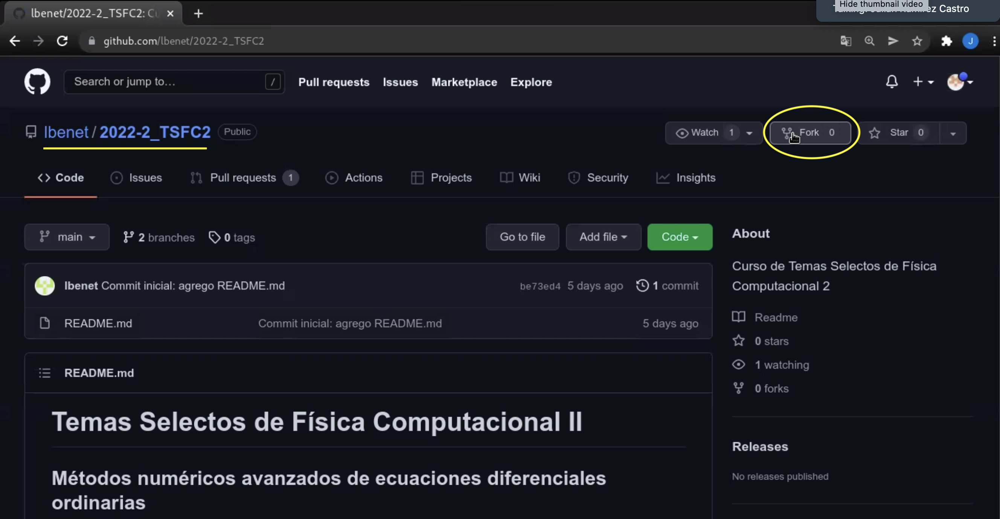
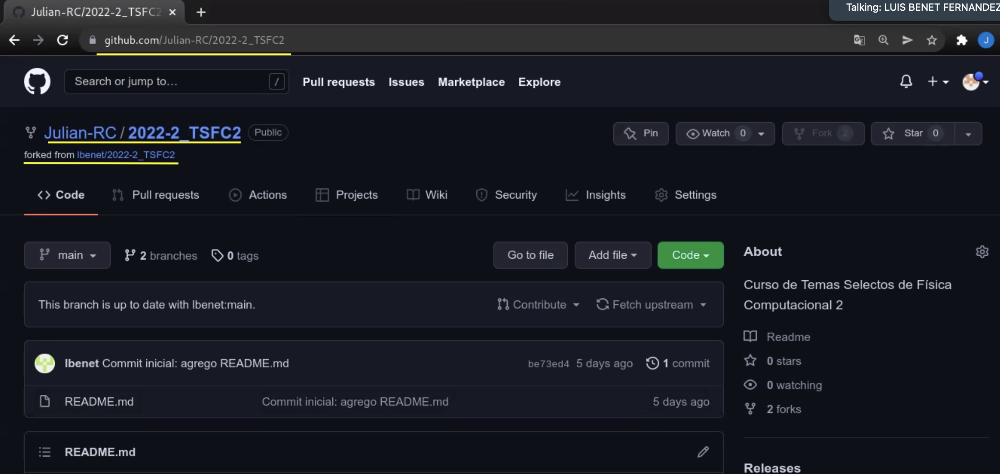
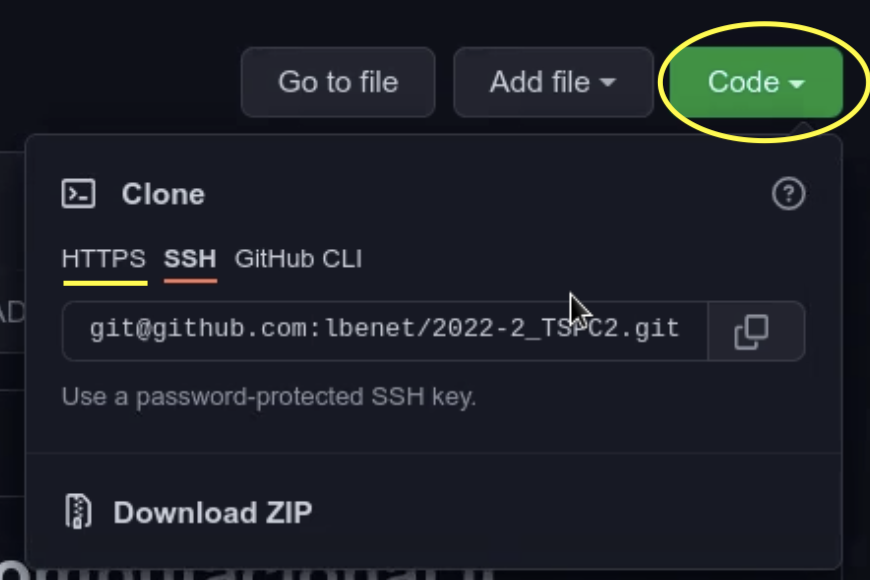
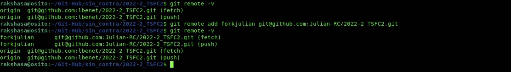

# Tutorial para el manejo del repositorio Git de la clase

## 0. Creación del fork

Como primer paso, deben crear un *fork* del repositorio del curso, es decir, una copia íntegra del repositorio y su historia a su espacio en GitHub, y en el cual sí tienen permisos de escritura. Para hacer esto, navegarán a la página [principal del curso](https://github.com/lbenet/2022-2_TSFC2), y desde esta página usarán el botón *Fork* que aparece en la parte superior derecha de la página.



Esto nos llevará al fork que se ha creado, que será un repositorio en nuestro espacio. Vale la pena notar que nos encontramos en una copia íntegra del repositorio original, pero el URL ha cambiado. Hemos creado nuestro fork propio del curso!



## 1. Clonar repositorio y configuración local

Ahora, desde la página [principal del curso](https://github.com/lbenet/2022-2_TSFC2), usaremos el botón `CODE` y copiaremos la dirección que aparece usando la opción "https"; para usar la otra opción debemos tener ciertos programas instalados en nuestra máquina, que dependen del sistema operativo que se usa.



*Clonar* un repositorio significa copiarlo (íntegramente) a un directorio *local* en nuestra computadora. Debemos entonces decidir el directorio donde lo queremos tener, y nos dirigiremos ahí. Es importante recordar dónde clonamos el curso, ya que si no deberemos repetir este paso.

La siguiente instrucción clonará a disco el repositorio del curso, creando un nuevo directorio con el nombre `2022-2_TSFC2`
```
git clone https://github.com/lbenet/2022-2_TSFC2.git
```

Lo que haremos a continuación será *ligar* nuestra copia local del curso con el fork que hemos creado anteriormente en nuestro espacio de GitHub. Para hacer esto, usaremos el link del fork en nuestro espacio de GitHub, y no el link del curso, que nuevamente copiaremos usando el botón *CODE*. Esto es muy parecido, excepto que copiamos la ubicación de nuestro *fork*. La idea es: ligando los repositorios de manera adecuada podamos *contribuir* al curso, lo que en otras palabras significa poder enviar las tareas de manera adecuada (como *Pull Requests*).

Una vez copiada la dirección de nuestro fork, iremos a la carpeta local (en nuestra computadora) donde está la copia del curso clonado y ahí ejecutaremos la instrucción:

```
git remote add forkjulian git@github.com:Julian-RC/2022-2_TSFC2.git
```
que es `git remote add` + *alias del fork* + *link al fork*. Esta instrucción lo que hace es *definir* una abreviatura (*forkjulian*) a la dirección URL dónde está el fork del curso que hicimos. Cabe destacar que como *alias del fork* podemos colocar cualquier nombre, siempre y cuando no exista ya un fork con este nombre.

Para verificar que todo se hizo correctamente ejecutaremos:

```
git remote -v
```

En la siguiente imágen se observa el resultado de usar esta instrucción *antes* de agregar el fork, que hemos llamado *forkjulian*, y después de haberlo agregado.



El alias que aparece bajo el nombre *origin* es de donde hemos clonado el curso, es decir, corresponde a la dirección del curso en GitHub. Por otro lado, el alias *forkjulian* corresponde a la dirección del fork en el repositorio de Julián. Ahí él tiene permisos de escritura.


## 2. Actualizaciones del curso

Para mantener actualizado tu fork con el repositoro del curso se debe ejecutar:

```git
git checkout main
git pull origin
git push mifork
```
La primer instrucción nos pasa a la rama `main`; la segunda descarga las actualizaciones que hay en `origin`, es decir, en el repositorio del curso. Finalmente, la última sube los cambios al servidor remoto `mifork`.

Un consejo muy importante es **siempre** trabajar en ramas *diferentes* a `main`. Esto evitará pelearse con `git`; trabajar en `main` hace que su fork y `origin` diverjan.

## 3. Envío de las tareas

Primero, asegúrense de actualizar su fork a la versión actualizada del curso en la rama `main`, tal y como se describió en la sección anterior.

El envío de las tarea se realizará el siguiente de la siguiente manera:

- Primero, cada tarea se debe enviar desde una *rama nueva*; es muy importante **no** hacerlo desde la rama `main`. Para efectos del ejemplo usaremos la rama `Tarea1` que se crea *desde* la rama `main`, usando:
  ```
  git branch Tarea1
  git checkout Tarea1
  ```
  El primer comando crea la rama `Tarea1`, y el segundo nos cambia a esa rama. Una alternativa a estos comandos es usar `git checkout -b Tarea1`.

  Para confirmar que estamos en la rama donde queremos estar, podemos usar el comando `git branch -v`, que señalará con un asterisco la rama en la que nos encntramos, o usando `git status` y leyendo la primer línea de la información que se proporciona.

  Es importante que cada tarea se haga en una rama distinta.

- Las tareas se harán dentro de la carpeta `tareas`, donde se creará un directorio para cada estudiante (usando el nombre o apellido) o por equipo. En ese directorio se incluirá el o los archivos que se indican en la tarea. Es importante *sólo* incluir los archivos que se especifican en la tarea, y no archivos extras que pueden resultar de su trabajo a la hora de hacer la tarea. Incluir otros archivos alentará la aceptación de la tarea.

- Para *agregar* el o los archivos necesarios, debemos agregarlos al índice de `git` y a la lista de archivos *comprometidos* del repositorio. Esto lo hacemos con
  ```git
  git add <nombre_archivo>
  ```
  Esta instrucción se puede agregar varias veces seguidas. Cuando quieran comprometer los cambios, usarán
  ```git
  git commit -m "Mensaje descriptivo de los cambios"
  ```
  El número final de commits es irrelevante para la aceptación de la tarea.

- Finalmente, hay que *subir* los cambios propuestos a *su fork*. En esto es importante que sean consistentes con la rama que usaron para la tarea. Para subir los archivos agregados a tu fork en GitHub, ejecutarán la siguiente instrucción:
  ```git
  git push mifork Tarea1
  ```
  donde `Tarea1` es el nombre de la rama a la que quieren sincronizar los cambios en el repositorio remoto, y `mifork` es el alias del repositorio remoto. *Únicamente* la primera vez que suben a esa rama deben ejecutar `git push -u mifork Tarea1`, lo que indica que los cambios se sincronizarán con la rama en la que están. Usualmente, el nombre de las ramas (local y remota) es el mismo.

Con lo anterior, hemos logrado subir los cambios locales (en nuestra computadora) a nuestro fork del curso en GitHub, pero estos cambios no han sido propuesto a ser agregados al repositorio del curso. Para proponer que los cambios se agreguen al repositorio del curso, hay que hacer un *pull request*. Para esto, hay que entrar a GitHub (a nuestra cuenta), y desde el repositorio que corresponde al *fork* del curso, en la parte superior izquierda, *abrir* un *pull request*. En general, el *pull request* liga una rama de nuestro repositorio con un cambio nuevo (a la rama `main`) del repositorio del curso. En ocasiones, el navegador *nota* los cambios en el repositorio que corresponde al *fork* del curso, y entonces, a través de un letrero amarillo, propone un botón con la leyenda `Compare & pull request`.

## 4. Avances y mejoras en la tarea

Para subir nuevos avances o mejoras en las tareas, simplemente hay que actualizar los cambios en la rama de nuestro fork. Esto es, localmente hay que guardar los cambios (`git add ...` seguido de `git commit ...`), y subirlos a nuestro *fork* del curso (`git push mifork <rama>`). Esto actualizará automáticamente los cambios que se han propuesto en el *pull request*. Esta es la manera de incorporar los comentarios y la retroalimentación que se da en torno a la tarea, y avanzar en ella.

